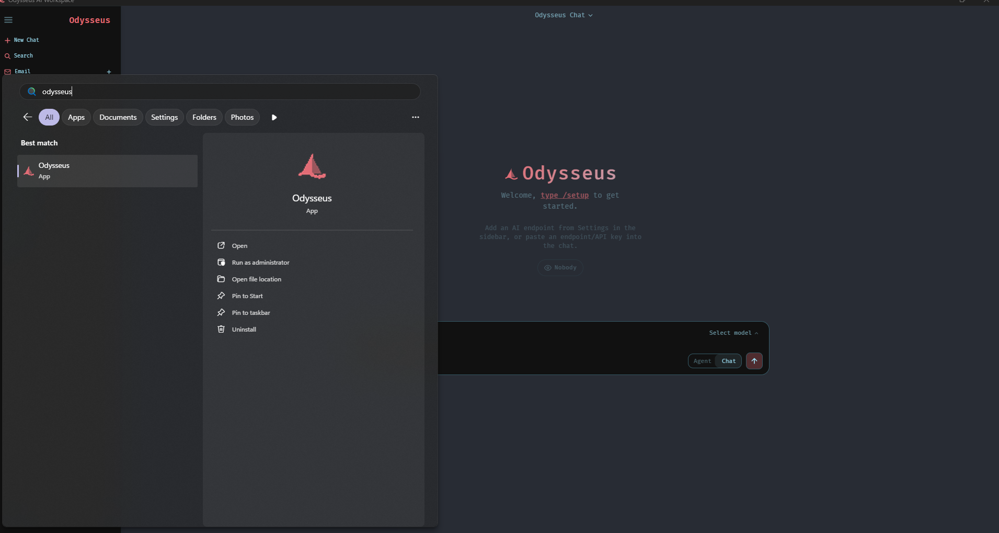

<p align="center">
  
</p>

<p align="center">
  A self-hosted AI workspace for chat, agents, research, documents, email, notes, calendar, and local model workflows — packaged as a native Windows desktop app.
</p>

<p align="center">
  <a href="#quick-start-windows-desktop">Quick Start</a> ·
  <a href="#what-the-desktop-app-does">What it does</a> ·
  <a href="#features">Features</a> ·
  <a href="#other-ways-to-run-it">Other install methods</a>
</p>

<p align="center">
  
</p>


---

> **About this build:** Ease of use install for [Odysseus](https://github.com/pewdiepie-archdaemon/odysseus), **#FirstWorldProblems** Edition. On top of the upstream web app it adds `odysseus-desk[...]

## Quick Start (Windows Desktop)

**Requirements:** Python 3.11+ and [Git for Windows](https://git-scm.com/download/win).
 
Run these in **Command Prompt** (`cmd`) — not PowerShell, which blocks script shims by default:

```bat
git clone https://github.com/whoxllm/odysseus-desktop.git
cd odysseus-desktop
python -m venv venv
venv\Scripts\python.exe -m pip install -r requirements.txt
venv\Scripts\python.exe odysseus-desktop.py
```

The harness creates its data directory and database on first run, starts the backend, and opens the app in its own window. There's **no separate setup step**: the app's own "Create Admin Account" [...]

> **Always call `venv\Scripts\python.exe` directly** instead of running `venv\Scripts\activate` and then bare `python`/`pip`. On machines with more than one Python (Windows Store stubs, other venv[...]
>
> To verify you're on the right interpreter: `venv\Scripts\python.exe -c "import sys; print(sys.executable)"` should print a path inside your `odysseus-desktop\venv\` folder. If it doesn't, delete[...]

`requirements.txt` pulls the harness's own dependencies — `pywebview`, `pystray`, and `pillow` — automatically. All three are required; without them the app crashes on import.

## What the desktop app does

`odysseus-desktop.py` is a packaged desktop experience:

- **Managed backend.** Starts the uvicorn server as a supervised subprocess and health-checks it, auto-restarting on crash (up to 5 retries). You never run `uvicorn` yourself.
- **Native window.** Embeds the web UI in a real [pywebview](https://pywebview.flowrl.com/) window — no browser, no tab.
- **System tray** (boat icon) with **Open Odysseus**, **Start/Stop Backend**, **Reset Account (First-Run Setup)**, **Add to Start Menu**, and **Quit**.
- **Close-to-tray.** The window's close button hides to the tray instead of quitting; use tray → **Quit** to fully exit.
- **Start Menu shortcut.** On first launch it writes a per-user shortcut (`…\Start Menu\Programs\Odysseus.lnk`) pointing a windowless Python at the harness, so Odysseus is searchable/launchable [...]
- **Correct taskbar icon.** Sets an explicit AppUserModelID so Windows shows the Odysseus boat icon in the taskbar instead of the generic Python host icon.

### First launch & admin account

On first run the web UI detects there's no admin account and shows a **Create Admin Account** screen (username + password) instead of a login form — fill it in and you're logged in as admin. No [...]

**Resetting the account:** to redo setup (testing, handing the app to someone else, forgotten password), use the tray's **Reset Account (First-Run Setup)**. It clears the stored admin credentials,[...]

### Local models

For local inference, point Odysseus at your endpoint in **Settings** after launch — e.g. `http://localhost:11434/v1` for [Ollama](https://ollama.com/), or any OpenAI-compatible server (`llama.cp[...]

### Packaging a standalone `.exe` (optional)

```bat
venv\Scripts\python.exe -m PyInstaller odysseus-desktop.spec
```
Output: `dist\Odysseus Desktop.exe`.

## Features

- **Chat + Agents** — local/API models, tools, MCP, files, shell, skills, and memory.
- **Cookbook** — hardware-aware model recommendations, downloads, and serving.
- **Deep Research** — multi-step web research with source reading and report generation.
- **Compare** — blind side-by-side model testing and synthesis.
- **Documents** — writing-first editor with AI edits, suggestions, Markdown, HTML, CSV, and syntax highlighting.
- **Email** — IMAP/SMTP inbox with triage, tags, summaries, reminders, and reply drafts.
- **Notes, Tasks + Calendar** — reminders, todos, scheduled agent tasks, and CalDAV sync.
- **Extras** — gallery/image editor, themes, uploads, web search, presets, sessions, and 2FA.

## Other ways to run it

The desktop harness is a wrapper around the standard Odysseus backend, so every non-Windows deployment still works. The most common alternative is Docker:

```bash
cp .env.example .env
docker compose up -d --build
```

Open `http://localhost:7000` when the containers are healthy; the first admin password is printed in `docker compose logs odysseus`. Native Linux/macOS installs, GPU notes, HTTPS, and configuratio[...]

## Security

Odysseus is a self-hosted workspace with powerful local tools. Keep auth enabled, keep private data out of Git, and do not expose raw model/service ports publicly. Deployment details are in the [s[...]

## License

AGPL-3.0-or-later — see [LICENSE](LICENSE) and [ACKNOWLEDGMENTS.md](ACKNOWLEDGMENTS.md). Built on [Odysseus](https://github.com/pewdiepie-archdaemon/odysseus).
